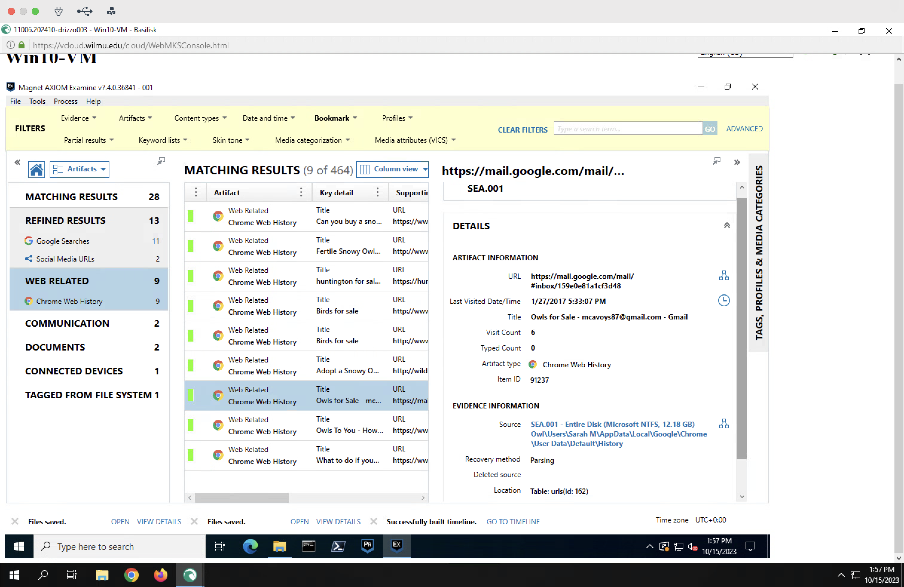

# FORENSIC REPORT

## Investigator Information
**David Rizzo**  
B.S. Cyber Security  
Wilmington University, New Castle, Delaware  
Digital Forensic Examiner

## Case Details
**Subject:** Digital Forensics Examination Report  
**Offence:** Illegal purchase, sale, or trade of owls  
**Accused:** Sarah McAvoy  
**Date of Request:** October 2, 2023  
**Date of Conclusion:** October 15, 2023  

## Table of Contents
1. [Background to the Case](#background-to-the-case)
2. [Questions Relevant to the Case](#questions-relevant-to-the-case)
3. [Evidence to Search For](#evidence-to-search-for)
4. [List of Criminal Charges](#list-of-criminal-charges)
5. [List of Obtained Evidence](#list-of-obtained-evidence)
6. [Examination Details](#examination-details)
7. [Hash Values for Exported Evidence](#hash-values-for-exported-evidence)
8. [Web and Message Evidence](#web-and-message-evidence)
9. [Conclusion](#conclusion)
10. [Generated Material](#generated-material)

## Background to the Case

It is illegal to trade and buy owls. Sarah McAvoy is being accused of being associated with the sale, purchase, or trade of owls. During the arrest of the accused (Sarah McAvoy), a computer was seized. Following a digital investigation, it was determined that the computer belonged to Sarah McAvoy, and contained web history showing the intention of acquiring an owl.

To conduct an effective and efficient investigation, I used Forensic Tool Kit Imager (FTK Imager) to create a forensic image of the hard drive that was seized during the arrest.

## Questions Relevant to the Case

While the user account on the computer shows it is Ms. McAvoy's account, there are some questions that need to be addressed to verify the legitimacy of the data acquired.

**Questions:**
1. Is the computer owned by Sarah McAvoy?
2. Does anyone else have access to the computer or Ms. McAvoy's credentials?

## Evidence to Search For

Based on the nature of the case, obtaining evidence for the case began with:
- (A) investigating the search history for recent searches
- (B) investigating the web browser history for recently accessed websites
- (C) the local files on the computer
- (D) recently deleted files
- (E) direct messages

## List of Criminal Charges

The list of criminal charges facing Sarah McAvoy are illegally acquiring an owl.

## List of Obtained Evidence

1. **Skype Message to Matt**  
   "Thanks for the hookup"

2. **Folder called "New Pet Care"**  
   C:\Users\Sarah M\Documents\New Pet Care

3. **"My New Pet.jpg"**  
   C:\Users\Sarah M\Documents\New Pet Care\My New Pet.jpg  
   Image of an Owl

4. **"Owl_Emergency_Care.pdf"**  
   C:\Users\Sarah M\Documents\My New Pet Care\Owl_Emergency_Care.pdf

5. **"Owl_Keeping.pdf"**  
   C:\Users\Sarah M\Documents\My New Pet Care\Owl_Keeping.pdf

6. **Email Exchange**  
   Email Subject: "Owls For Sale"

7. **Website**  
   "Can you buy a snowy owl"  
   "Reference.com"

8. **Website**  
   "Birdtrader.com"

9. **Google Search**  
   "Can you buy owl eggs"

## Examination Details

I used FTK Imager to create a forensic image of the computer's hard drive (serial #4&16302a59&0&010000) on 10/11/2023. The hash value after imaging is {5c39c799ead38fc6b87bedce336eedf7} MD5. This is to validate that none of the files were changed or modified during the investigation. 

It is known that the case involves the illegal trade of owls. This helps to direct the investigation to focus on important artifacts such as web history and direct messages. A direct message between Ms. McAvoy and a Matt Haze was discovered where she thanks him for a hook up. There were no messages prior or after that allude to what the hook up was. This should be used to question Mr. Haze pertaining to the hookup. 

There was web related activity found that show Ms. McAvoy visiting websites to acquire owls and searching how to buy or acquire an owl. She also searches if she could buy or acquire an owl. This shows she sought the knowledge that it was illegal to be involved with the sale, purchase, or trade of owls. There is an email subject in Ms. McAvoy's history titles Owls for sale.

## Hash Values for Exported Evidence

1. "My New Pet.jpg" {e8e72d75b45280f180926d98348d767b} MD5
2. "Owl_Emergency_Care.pdf" {f1865a9e357c9a1f75a02fe0525636c9} MD5
3. "Owl_Keeping.pdf" {ca022bdeab30a1657efe43a461ffec6b} MD5
4. "Snowy Owl Care.pdf" {6c9e450ed728f19fe2fb6c7c0e76dc85} MD5

## Web and Message Evidence

## Conclusion

During the investigation into the computer that was obtained as evidence during the arrest of Sarah McAvoy, I was able to hash the computer's hard drive and the files. This is to prove the originality of the files to the time they were received for investigation and that nothing was changed during the course of the investigation. 

I was also able to find a direct message between Ms. McAvoy and Mr. Haze referring to a hookup. There is no mention of what the hookup is but warrants further investigation. There was also web history found indicating research on how to acquire and owl as well as websites for purchasing and owl. There was an email subject recovered indicating that Ms. McAvoy received an email about owls for sale. 

On Ms. McAvoy's hard drive there was a folder called new pet care that contained an image of an owl. That image was labeled as "My New Pet.jpg". There was also documents about the care and uptake of an owl in the folder.

## Generated Material
- Document of Findings and Report
- Evidence Found
- Screen Shots of Digital Evidence Found
